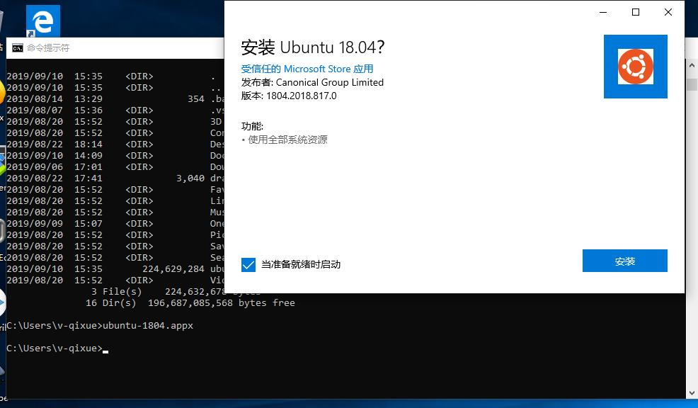
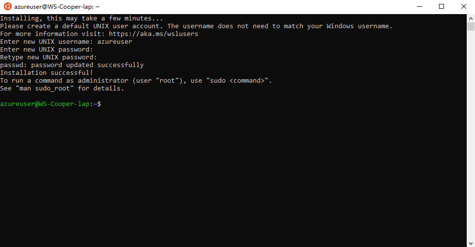

## Azure CLI是什么

Azure CLI是一个跨平台的命令行工具，用于管理和维护Microsoft Azure上的服务和资源。
类似与PowerShell, Azure CLI提供了从命令行使用和管理Azure服务和资源的方法。您仍然可以像以前一样继续使用PowerShell、API和Azure Portal。
Azure CLI非常灵活，可以快速安装在几乎任何平台上。

## 安装Azure CLI
如何安装Azure CLI取决于你需要在什么平台上使用它， 最简单的方法是在Windows、MacOS、Linux或Docker容器中本地运行它。
您也可以在Windows 10上使用Windows Subsystem for Linux(WSL)。

**安装在Windows**

在Windows中安装Azure CLI，下载[安装包](https://aka.ms/installazurecliwindows)。

**安装在macOS**  

在macOS中安装Azure CLI， 运行如下命令:
```
brew update && brew install azure-cli
```

**安装在Linux**

在Linux上的安装步骤取决于Linux的发行版本，具体指引请参考[这里](https://docs.microsoft.com/en-us/cli/azure/install-azure-cli-apt?view=azure-cli-latest).

**安装在WSL（on Windows 10)

首先，安装WSL，以ubuntu18.04为例，在命令行工具(command prompt)中, 从微软商店下载ubuntu-1804.appx文件。
```
curl.exe -L -o ubuntu-1804.appx https://aka.ms/wsl-ubuntu-1804
```
然后，使用PowerShell启用WSL。
```
Enable-WindowsOptionalFeature -Online -FeatureName Microsoft-Windows-Subsystem-Linux
```
注意：命令执行完以后需要重启系统。

最后， 在命令行工具中，执行ubuntu-1804.appx的安装。



安装完成以后，运行Linux系统，初次运行需要花费时间完成初始化操作。


参照[在Linux中安装Azure CLI](https://docs.microsoft.com/en-us/cli/azure/install-azure-cli-apt?view=azure-cli-latest)完成Azure CLI的安装.

**安装在Docker上**


